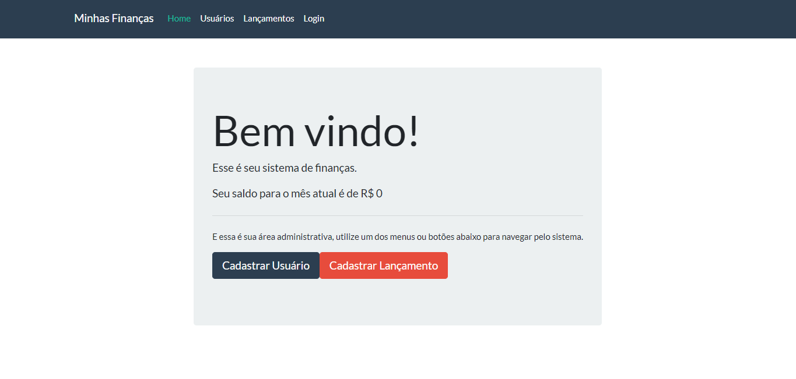

# Minhas Finanças - REACT APP - By Cesário Pereira Neto
-

-
Consiste em uma aplicação de controle de finanças de muitos usuários,
onde é possivel cadastrar, listar, atualizar e deletar movimentações financeiras e obter o saldo disponível com base nas transações cadastradas.
Esta aplicação foi desenvolvida durante o curso ["Spring Boot + React JS: Desenvolva Aplicações Web Completas"](https://www.udemy.com/share/102a8mCUYYdFpVRXg=/) do professor [Dougllas Sousa](https://www.linkedin.com/in/dougllassousa/) com o objetivo de consumir a API ["Minhas Financas - API - By Cesário Pereira Neto](https://github.com/cesarionto/api-minhas-financas).

# Tecnologias Utilizadas

- Feito em Javascript usando o [React](https://pt-br.reactjs.org/), pelo comando 'npx create-react-app'.
- Gerenciamento de requisição com o [Axios](https://github.com/axios/axios/).

